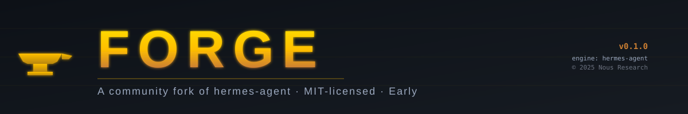

<p align="center">
  
</p>

# Forge ⚒

<p align="center">
  <a href="https://github.com/ComputPhillip/Forge/blob/main/LICENSE"></a>
  <a href="https://github.com/ComputPhillip/Forge"></a>
  <a href="NOTICE"></a>
</p>

> **What this is:** Forge is a community fork of [hermes-agent](https://github.com/NousResearch/hermes-agent) by [Nous Research](https://nousresearch.com), distributed under the same MIT license. Upstream copyright is preserved in [LICENSE](LICENSE) and fork attribution is documented in [NOTICE](NOTICE).
>
> **What it's for:** Forge exists to explore divergent design choices on top of hermes-agent's foundation — different defaults, alternative tool surfaces, experimental harness ergonomics. Production users should evaluate upstream hermes-agent first; it has a larger community and faster security response.

---

**The self-improving AI agent — Forge inherits hermes-agent's full capability set:** a built-in learning loop that creates skills from experience, improves them during use, nudges itself to persist knowledge, searches its own past conversations, and builds a deepening model of who you are across sessions. Runs on a $5 VPS, a GPU cluster, or serverless infrastructure that costs nearly nothing when idle. Not tied to your laptop — talk to it from Telegram while it works on a cloud VM.

Use any model you want — [Nous Portal](https://portal.nousresearch.com), [OpenRouter](https://openrouter.ai) (200+ models), [NovitaAI](https://novita.ai), [NVIDIA NIM](https://build.nvidia.com), [Xiaomi MiMo](https://platform.xiaomimimo.com), [z.ai/GLM](https://z.ai), [Kimi/Moonshot](https://platform.moonshot.ai), [MiniMax](https://www.minimax.io), [Hugging Face](https://huggingface.co), OpenAI, or your own endpoint. Switch with `forge model` — no code changes, no lock-in.

<table>
<tr><td><b>A real terminal interface</b></td><td>Full TUI with multiline editing, slash-command autocomplete, conversation history, interrupt-and-redirect, and streaming tool output.</td></tr>
<tr><td><b>Lives where you do</b></td><td>Telegram, Discord, Slack, WhatsApp, Signal, and CLI — all from a single gateway process. Voice memo transcription, cross-platform conversation continuity.</td></tr>
<tr><td><b>A closed learning loop</b></td><td>Agent-curated memory with periodic nudges. Autonomous skill creation after complex tasks. Skills self-improve during use. FTS5 session search with LLM summarization for cross-session recall. Compatible with the <a href="https://agentskills.io">agentskills.io</a> open standard.</td></tr>
<tr><td><b>Scheduled automations</b></td><td>Built-in cron scheduler with delivery to any platform. Daily reports, nightly backups, weekly audits — all in natural language, running unattended.</td></tr>
<tr><td><b>Delegates and parallelizes</b></td><td>Spawn isolated subagents for parallel workstreams. Write Python scripts that call tools via RPC, collapsing multi-step pipelines into zero-context-cost turns.</td></tr>
<tr><td><b>Runs anywhere, not just your laptop</b></td><td>Seven terminal backends — local, Docker, SSH, Singularity, Modal, Daytona, and Vercel Sandbox. Daytona and Modal offer serverless persistence — your agent's environment hibernates when idle and wakes on demand.</td></tr>
<tr><td><b>Research-ready</b></td><td>Batch trajectory generation, trajectory compression for training the next generation of tool-calling models.</td></tr>
</table>

---

## Status — Early Fork

Forge is currently a **branding-stage fork**. The codebase is functionally hermes-agent with the user-visible surface rebranded. Substantive divergence (different defaults, alternative tools, harness changes) is a work in progress and will be documented in [CHANGELOG.md](CHANGELOG.md) as it lands.

If you want the most stable, most-tested experience today, install hermes-agent directly. If you want to experiment with Forge's evolving direction or contribute to a smaller community fork, you're in the right place.

---

## Quick Install

> **Note:** Forge installation currently goes through the upstream installer because the fork hasn't published its own install scripts yet. Once Forge has divergent install needs, this section will be updated.

### Linux, macOS, WSL2, Termux

```bash
# Install upstream hermes-agent, then check out Forge over it
curl -fsSL https://raw.githubusercontent.com/NousResearch/hermes-agent/main/scripts/install.sh | bash
git clone https://github.com/ComputPhillip/Forge.git ~/forge
cd ~/forge && uv pip install -e .
```

### Windows (native, PowerShell) — Early Beta

```powershell
# Upstream installer first
iex (irm https://raw.githubusercontent.com/NousResearch/hermes-agent/main/scripts/install.ps1)
# Then clone Forge
git clone https://github.com/ComputPhillip/Forge.git C:\Users\$env:USERNAME\Forge
cd C:\Users\$env:USERNAME\Forge
uv pip install -e .
```

After installation:

```bash
forge              # start chatting (Forge CLI, formerly `hermes`)
```

---

## Getting Started

```bash
forge              # Interactive CLI — start a conversation
forge model        # Choose your LLM provider and model
forge tools        # Configure which tools are enabled
forge config set   # Set individual config values
forge gateway      # Start the messaging gateway (Telegram, Discord, etc.)
forge setup        # Run the full setup wizard (configures everything at once)
forge update       # Update to the latest Forge version
forge doctor       # Diagnose any issues
```

The `hermes` command is preserved as a backward-compatible alias during the fork transition. Both invoke the same binary.

---

## How Forge Differs from hermes-agent

This section will grow as Forge accumulates divergent design choices. As of the initial fork:

| Aspect | hermes-agent | Forge |
|---|---|---|
| CLI binary name | `hermes` | `forge` (with `hermes` alias) |
| Environment variable prefix | `HERMES_*` | `FORGE_*` (with `HERMES_*` backward-compat) |
| Brand identity | Nous Research | Independent community fork |
| Codebase | Same | Same (initial fork) |

Concrete divergence is planned but not yet shipped. Watch [CHANGELOG.md](CHANGELOG.md) and the issue tracker for what's coming.

---

## Contributing

Contributions to Forge are welcome under the same MIT license. Before opening a substantial PR:

1. Consider whether the change belongs upstream in hermes-agent first. If yes, please open the PR there as well or instead — that's the right home for fixes and broadly useful improvements.
2. Forge-specific changes (those that intentionally diverge from upstream behavior or branding) belong here.
3. Read [CONTRIBUTING.md](CONTRIBUTING.md) for the contribution workflow inherited from hermes-agent, which Forge follows.

---

## Attribution

Forge would not exist without [hermes-agent](https://github.com/NousResearch/hermes-agent) and the work of [Nous Research](https://nousresearch.com). The MIT license at the root of this repository preserves their copyright unchanged, as required. The [NOTICE](NOTICE) file documents the fork point and our relationship to upstream.

If you find Forge useful and want to support the underlying technology, please also consider supporting Nous Research's work on hermes-agent.

---

## License

MIT — see [LICENSE](LICENSE) for the full text. Original copyright © 2025 Nous Research. Contributions to Forge are also MIT-licensed.
